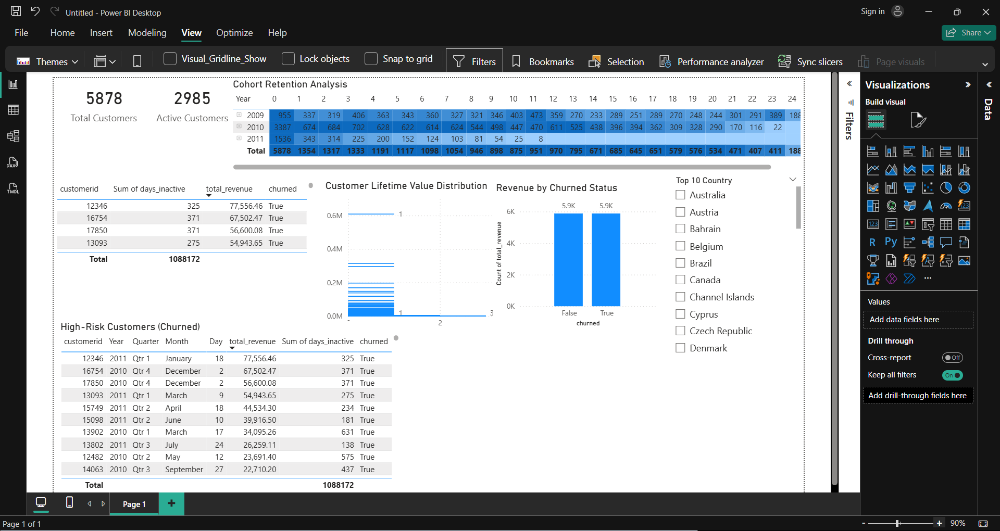

# Customer Lifetime Value (CLV) & Churn Analytics

## Project Overview
This project is a **customer analytics solution** designed to analyze **customer value, churn behavior, and retention patterns** using real-world retail transaction data.

The objective is to convert raw transactional data into **actionable business insights** that help improve customer retention and long-term revenue.

---

## Business Problem
Retail businesses often struggle to answer key questions such as:
- Which customers generate the most revenue over time?
- How many customers have churned, and what revenue is at risk?
- How does customer retention change over time?
- Which customers should be prioritized for retention strategies?

This project addresses these questions through structured analytics and visualization.

---

## Tools & Technologies
- **Python (Pandas, NumPy)** – Data cleaning, feature engineering, CLV & churn logic  
- **SQL (SQLite)** – Cohort analysis and churn analytics  
- **Power BI** – Executive dashboard and data visualization  
- **VS Code** – Development environment  
- **GitHub** – Version control and documentation  

---

## Project Structure
customer-clv-churn-analytics
- data
  - raw          # Original raw dataset
  - processed    # Cleaned transactional data
  - final        # Customer-level analytics output
- python
  - 00_data_understanding.py
  - 01_data_cleaning.py
  - 02_clv_analysis.py
  - 03_churn_logic.py
  - 04_load_sql.py
- sql
  - 01_cohort_analysis.sql
  - 02_churn_analysis.sql
- dashboard
  - dashboard_overview.png
  - clv_churn_dashboard.pbix
- insights
  -business_insights.md
- README.md

---

## Project Workflow

### Data Understanding
- Inspected dataset structure and date ranges  
- Identified missing values, cancellations, and invalid transactions  

---

### Data Cleaning & Preparation (Python)
- Removed cancelled invoices  
- Removed records with missing customer IDs  
- Filtered invalid quantities and prices  
- Standardized column names  
- Created a **revenue** metric  

Cleaned data saved to:
data/processed/cleaned_data.csv

---

### Customer Lifetime Value (CLV)
Calculated customer-level metrics:
- Total revenue per customer  
- Total number of orders  
- Average order value  

Output:
data/final/customer_clv.csv

---

### Churn Analysis
Defined churn using business logic:
- Customers inactive for more than **90 days** are considered churned  

Output:
data/final/customer_churn.csv

---

### SQL Analytics & Cohort Analysis
- Loaded cleaned data into SQLite  
- Used SQL CTEs and date calculations to:
  - Create customer cohorts based on first purchase month  
  - Analyze customer retention trends  
  - Measure revenue impact of churn  

---

### Power BI Dashboard
Built an executive-level dashboard featuring:
- KPI cards for total, active, and churned customers  
- Customer Lifetime Value (CLV) distribution  
- Revenue comparison between active and churned customers  
- Cohort retention heatmap  
- High-risk customer identification table  

Dashboard file:
dashboard/clv_churn_dashboard.pbix

---

## Dashboard Preview

The full interactive Power BI dashboard is available as:
`dashboard/clv_churn_dashboard.pbix`

---

## Key Insights
- A small percentage of customers contribute the majority of revenue  
- High-value customer churn represents significant revenue risk  
- Older customer cohorts show better long-term retention  
- Targeted retention strategies can improve customer lifetime value  

---

## Skills Demonstrated
- Real-world data cleaning and validation  
- Customer Lifetime Value (CLV) analysis  
- Churn analysis using business logic  
- Cohort and retention analytics  
- SQL analytics with CTEs and date functions  
- Power BI dashboard design and storytelling  
- Professional project structuring and documentation  

---

## Conclusion
This project demonstrates the ability to transform raw transactional data into **customer intelligence insights** that support data-driven decision-making in customer retention and revenue growth.

